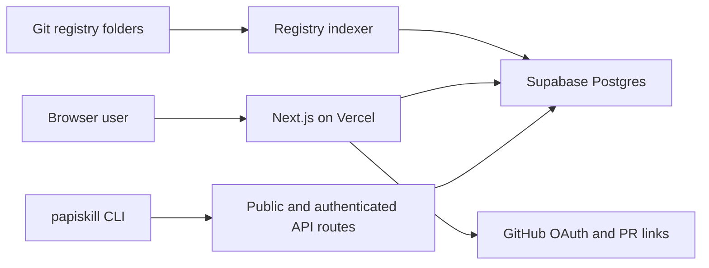

# Architecture Overview

## System Shape

PapiSkill is a monorepo with three production surfaces:

- web app: registry, profiles, editor, downloads, auth, API
- CLI: install, search, validate, download, private auth
- registry packages: Git-reviewed global and community skill packages

## Source Of Truth

| Data | Source of truth |
|---|---|
| Globally published skill package files | Git repo under `registry/official` |
| Community Git-reviewed package files | Git repo under `registry/community` |
| Indexed search metadata | Postgres |
| User profile | Postgres |
| User library skills | Postgres |
| Stars/download events | Postgres |
| CLI tokens | Postgres, hashed |
| Auth sessions/accounts | Better Auth tables in Postgres |

## Runtime Components

## Request Boundaries

- Public registry reads can be anonymous.
- Private library reads require owner session or valid CLI token.
- Mutations require session authentication.
- API token management requires session authentication.
- Global registry mutations do not happen directly through the app; they go through collaborator publishing and GitHub PRs.

## Performance Strategy

- Public registry list/detail/download responses are safe to cache briefly because they contain only public global/community metadata and files.
- Profile-owned private library reads must stay `no-store` and must derive access from a server session or valid CLI token.
- Public browsing pages should fetch summary rows first and load full `SKILL.md` content only for detail/download surfaces or the single selected preview.
- Authenticated dashboard routes stay dynamic, but they should show route-level loading states while session and owner-scoped data loads.
- Links to authenticated copy flows and download route handlers should not prefetch from public listing cards.
- Mutations that change public profile or library visibility must revalidate `/skills`, `/authors`, `/api/v1/skills`, and the affected profile route.

## Deployment

- Vercel hosts the Next.js app.
- Supabase hosts Postgres.
- `papiskill.com` points to Vercel.
- CLI is published as an npm package when release credentials are available.
